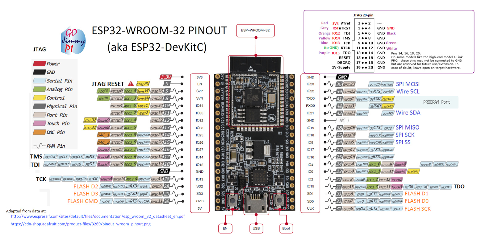

.. _p511:

Espressif32
============

Espressif Systems is a privately held fabless semiconductor company. They provide wireless communications and Wi-Fi chips which are widely used in mobile devices and the Internet of Things applications.

For more detailed information please visit `vendor site <https://espressif.com/?utm_source=platformio.org&utm_medium=docs>`_.

.. contents:: 目录索引
    :local:
    :depth: 1

.. include:: P51.rst

工程示例
-----------

工程中带有的示例，用于指导工程的配置和使用 `P511 Espressif32 <https://github.com/platformio/platform-espressif32/tree/master/examples?utm_source=platformio.org&utm_medium=docs>`_:

* `espidf-storage-sdcard <https://github.com/platformio/platform-espressif32/tree/master/examples/espidf-storage-sdcard?utm_source=platformio.org&utm_medium=docs>`_
* `espidf-blink <https://github.com/platformio/platform-espressif32/tree/master/examples/espidf-blink?utm_source=platformio.org&utm_medium=docs>`_
* `espidf-coap-server <https://github.com/platformio/platform-espressif32/tree/master/examples/espidf-coap-server?utm_source=platformio.org&utm_medium=docs>`_
* `espidf-storage-spiffs <https://github.com/platformio/platform-espressif32/tree/master/examples/espidf-storage-spiffs?utm_source=platformio.org&utm_medium=docs>`_
* `espidf-exceptions <https://github.com/platformio/platform-espressif32/tree/master/examples/espidf-exceptions?utm_source=platformio.org&utm_medium=docs>`_
* `arduino-blink <https://github.com/platformio/platform-espressif32/tree/master/examples/arduino-blink?utm_source=platformio.org&utm_medium=docs>`_
* `simba-blink <https://github.com/platformio/platform-espressif32/tree/master/examples/simba-blink?utm_source=platformio.org&utm_medium=docs>`_
* `espidf-ble-eddystone <https://github.com/platformio/platform-espressif32/tree/master/examples/espidf-ble-eddystone?utm_source=platformio.org&utm_medium=docs>`_
* `espidf-ulp-adc <https://github.com/platformio/platform-espressif32/tree/master/examples/espidf-ulp-adc?utm_source=platformio.org&utm_medium=docs>`_
* `espidf-ulp-pulse <https://github.com/platformio/platform-espressif32/tree/master/examples/espidf-ulp-pulse?utm_source=platformio.org&utm_medium=docs>`_
* `espidf-arduino-wifiscan <https://github.com/platformio/platform-espressif32/tree/master/examples/espidf-arduino-wifiscan?utm_source=platformio.org&utm_medium=docs>`_
* `espidf-http-request <https://github.com/platformio/platform-espressif32/tree/master/examples/espidf-http-request?utm_source=platformio.org&utm_medium=docs>`_
* `espidf-arduino-blink <https://github.com/platformio/platform-espressif32/tree/master/examples/espidf-arduino-blink?utm_source=platformio.org&utm_medium=docs>`_
* `pumbaa-blink <https://github.com/platformio/platform-espressif32/tree/master/examples/pumbaa-blink?utm_source=platformio.org&utm_medium=docs>`_
* `espidf-aws-iot <https://github.com/platformio/platform-espressif32/tree/master/examples/espidf-aws-iot?utm_source=platformio.org&utm_medium=docs>`_
* `espidf-peripherals-uart <https://github.com/platformio/platform-espressif32/tree/master/examples/espidf-peripherals-uart?utm_source=platformio.org&utm_medium=docs>`_
* `arduino-wifiscan <https://github.com/platformio/platform-espressif32/tree/master/examples/arduino-wifiscan?utm_source=platformio.org&utm_medium=docs>`_

Debugging
---------

.. contents::
    :local:

Pinout Diagram
~~~~~~~~~~~~~~

**JTAG Wiring Connections**

.. list-table::
  :header-rows:  1

  * - Board Pin
    - JTAG Tool Pin
  * - IO13
    - TCK
  * - IO12
    - TDI
  * - IO15
    - TDO
  * - IO14
    - TMS
  * - EN
    - RST
  * - GND
    - GND

Tools & Debug Probes
~~~~~~~~~~~~~~~~~~~~

Supported debugging tools are listed in "Debug" column. For more detailed
information, please scroll table by horizontal.

.. warning::
    You will need to install debug tool drivers depending on your system.
    Please click on compatible debug tool below for the further instructions.

External Debug Tools
^^^^^^^^^^^^^^^^^^^^

Boards listed below are compatible with :ref:`piodebug` but **DEPEND ON**
external debug probe. They **ARE NOT READY** for debugging.
Please click on board name for the further details.

.. list-table::
    :header-rows:  1

    * - Name
      - MCU
      - Frequency
      - Flash
      - RAM
    * - :ref:`h511`
      - ESP32
      - 240MHz
      - 4MB
      - 320KB

Stable and upstream versions
----------------------------

You can switch between `stable releases <https://github.com/platformio/platform-espressif32/releases>`__
of Espressif 32 development platform and the latest upstream version using
:ref:`projectconf_env_platform` option in :ref:`projectconf` as described below.

Stable
~~~~~~

.. code-block:: ini

    ; Latest stable version
    [env:latest_stable]
    platform = espressif32
    board = ...

    ; Custom stable version
    [env:custom_stable]
    platform = espressif32@x.y.z
    board = ...

Upstream
~~~~~~~~

.. code-block:: ini

    [env:upstream_develop]
    platform = https://github.com/platformio/platform-espressif32.git
    board = ...

Packages
--------

.. list-table::
    :header-rows:  1

    * - Name
      - Description

    * - `framework-arduino-mbcwb <https://briki.org?utm_source=platformio.org&utm_medium=docs>`__
      - Fork of Arduino Framework for briki MBC-WB boards

    * - `framework-arduinoespressif32 <https://github.com/espressif/arduino-esp32.git?utm_source=platformio.org&utm_medium=docs>`__
      - Arduino Wiring-based Framework for Espressif ESP32 microcontrollers

    * - `framework-espidf <https://docs.espressif.com/projects/esp-idf/en/latest/esp32/?utm_source=platformio.org&utm_medium=docs>`__
      - Espressif IoT Development Framework. Official development framework for ESP32 chip

    * - `framework-pumbaa <https://github.com/eerimoq/pumbaa.git?utm_source=platformio.org&utm_medium=docs>`__
      - Pumbaa Framework - a port of MicroPython, designed for embedded devices with limited amount of RAM and code memory

    * - `framework-simba <https://github.com/eerimoq/simba.git?utm_source=platformio.org&utm_medium=docs>`__
      - Simba is an Embedded Programming Platform. It aims to make embedded programming easy and portable

    * - `tool-cmake <https://cmake.org?utm_source=platformio.org&utm_medium=docs>`__
      - CMake is an open-source, cross-platform family of tools designed to build, test and package software

    * - `tool-esptoolpy <https://github.com/espressif/esptool.git?utm_source=platformio.org&utm_medium=docs>`__
      - Espressif ESP8266 and ESP32 serial bootloader utility

    * - `tool-idf <https://github.com/espressif/esp-idf/tree/master/tools.git?utm_source=platformio.org&utm_medium=docs>`__
      - idf is a top-level config/build command line tool for ESP-IDF

    * - `tool-mbctool <https://briki.org?utm_source=platformio.org&utm_medium=docs>`__
      - MBC-WB Uploader Application

    * - `tool-mconf <https://github.com/espressif/kconfig-frontends.git?utm_source=platformio.org&utm_medium=docs>`__
      - Fork of kconfig-frontends project with some modifications for use with ESP-IDF

    * - `tool-mkspiffs <https://github.com/igrr/mkspiffs.git?utm_source=platformio.org&utm_medium=docs>`__
      - Tool to build and unpack SPIFFS images

    * - `tool-ninja <https://ninja-build.org?utm_source=platformio.org&utm_medium=docs>`__
      - Ninja is a small build system with a focus on speed

    * - `tool-openocd-esp32 <http://openocd.org?utm_source=platformio.org&utm_medium=docs>`__
      - Open On-Chip Debugger for Espressif ESP32

    * - `toolchain-esp32s2ulp <https://github.com/espressif/esp-idf.git?utm_source=platformio.org&utm_medium=docs>`__
      - Binutils fork with support for the ESP32-S2 ULP co-processor

    * - `toolchain-esp32ulp <https://github.com/espressif/binutils-esp32ulp.git?utm_source=platformio.org&utm_medium=docs>`__
      - Binutils fork with support for the Espressif ESP32 ULP co-processor

    * - `toolchain-riscv-esp <https://github.com/espressif/crosstool-NG.git?utm_source=platformio.org&utm_medium=docs>`__
      - GCC Toolchain for Espressif 32-bit RISC-V based on GCC

    * - `toolchain-xtensa32 <https://github.com/espressif/esp-idf.git?utm_source=platformio.org&utm_medium=docs>`__
      - GCC Toolchain for Xtensa32 processor

    * - `toolchain-xtensa32s2 <https://github.com/espressif/crosstool-NG.git?utm_source=platformio.org&utm_medium=docs>`__
      - GCC Toolchain for Xtensa32-S2 processor

.. warning::
    **Linux Users**:

        * Install "udev" rules :ref:`faq_udev_rules`
        * Raspberry Pi users, please read this article
          `Enable serial port on Raspberry Pi <https://hallard.me/enable-serial-port-on-raspberry-pi/>`__.

    **Windows Users:**

        Please check that you have a correctly installed USB driver from board
        manufacturer

Frameworks
----------
.. list-table::
    :header-rows:  1

    * - Name
      - Description

    * - :ref:`framework_arduino`
      - Arduino Wiring-based Framework allows writing cross-platform software to control devices attached to a wide range of Arduino boards to create all kinds of creative coding, interactive objects, spaces or physical experiences

    * - :ref:`framework_espidf`
      - ESP-IDF is the official development framework for the ESP32 and ESP32-S Series SoCs.

    * - :ref:`framework_pumbaa`
      - Pumbaa is Python on top of Simba. The implementation is a port of MicroPython, designed for embedded devices with limited amount of RAM and code memory

    * - :ref:`framework_simba`
      - Simba is an RTOS and build framework with aims to make embedded programming easy and portable

Boards
------

.. note::
    * You can list pre-configured boards by command or
      `PlatformIO Boards Explorer <https://platformio.org/boards>`_
    * For more detailed ``board`` information please scroll the tables below by
      horizontally.

ESP32
~~~~~~~~~~

.. list-table::
    :header-rows:  1

    * - Name
      - Debug
      - MCU
      - Frequency
      - Flash
      - RAM
    * - :ref:`h511`
      - External
      - ESP32
      - 240MHz
      - 4MB
      - 320KB
