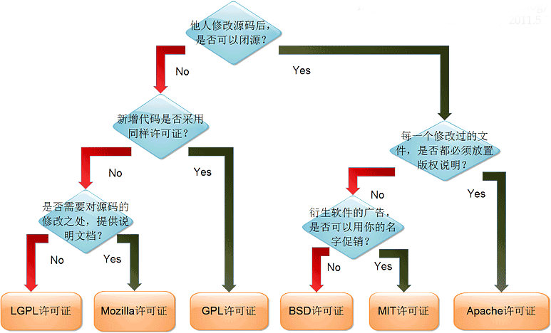

.. _license:

License
==================
.. contents::
    :local:

.. _license_gpl:

GUN GPL
-----------

GPL软件的使用者有权力得到软件的代码，只要使用了GPL，在发布(redistribution)时，整个项目也必须是GPL的，即主程序和静态链接的库（linux的.a和Windows的.lib）必须是GPL的，动态链接库(Linux的.so，Windows的.dll)必须是GPL兼容的。所谓GPL兼容，也就是GPL软件中可以使用的库，这些许可证必须比GPL弱(如LGPL，BSD)，而不能是某个商业许可证。正因如此，GPL是带有很强的传染性，只要你的软件使用了GPL的代码，那么就请以GPL开放源代码吧，并且你的项目中也不能有任何和GPL不兼容的库。

* 可自由复制，你可以将软件复制到你的电脑，你客户的电脑，或者任何地方。复制份数没有任何限制。
* 可自由分发，在你的网站提供下载，拷贝到U盘送人，或者将源代码打印出来从窗户扔出去（环保起见，请别这样做）。
* 可以用来盈利，你可以在分发软件的时候收费，但你必须在收费前向你的客户提供该软件的 GNU GPL 许可协议，以便让他们知道，他们可以从别的渠道免费得到这份软件，以及你收费的理由。
* 可自由修改，如果你想添加或删除某个功能，没问题，如果你想在别的项目中使用部分代码，也没问题，唯一的要求是，使用了这段代码的项目也必须使用 GPL 协议。

需要注意的是，分发的时候，需要明确提供源代码和二进制文件，另外，用于某些程序的某些协议有一些问题和限制，使用 GPL 协议，你必须在源代码代码中包含相应信息，以及协议本身。

.. _license_lgpl:

GUN LGPL
-----------

:ref:`license_gpl` 带有很强的传染性，那么如果一个库使用GPL发布，那么使用这个库的所有软件也必须使用GPL发布，这对不想开放源代码的商业软件来讲是致命的打击——你可以不使用其他的库，但最基本的libc是无论如何绕不开的，如果libc是以GPL发布，就相当于所有软件必须以GPL发布了。所以，LGPL(Lesser GPL)诞生了。

LGPL定义为，在以LGPL发布的库的基础上开发新的库的时候，新的库必须以LGPL发布，但是如果仅仅是动态链接，那么则不受任何限制。这样商业软件就可以随意的使用LGPL的库了。因此，LGPL也具有传染性，但限制在其基础上开发的库上，而并不限制使用它的程序本身——它的传染性远小于GPL。

LGPL是GPL的一个为主要为类库使用设计的开源协议。和GPL要求任何使用/修改/衍生之GPL类库的的软件必须采用GPL协议不同。LGPL允许商业软件通过类库引用(link)方式使用LGPL类库而不需要开源商业软件的代码。这使得采用LGPL协议的开源代码可以被商业软件作为类库引用并发布和销售。

但是如果修改LGPL协议的代码或者衍生，则所有修改的代码，涉及修改部分的额外代码和衍生的代码都必须采用LGPL协议。因此LGPL协议的开源代码很适合作为第三方类库被商业软件引用，但不适合希望以LGPL协议代码为基础，通过修改和衍生的方式做二次开发的商业软件采用。

GPL/LGPL都保障原作者的知识产权，避免有人利用开源代码复制并开发类似的产品。

.. _license_bsd:

BSD
-----------

BSD 在软件分发方面的限制比别的开源协议（如 GNU GPL）要少。该协议有多种版本，最主要的版本有两个，新 BSD 协议与简单 BSD 协议，这两种协议经过修正，都和 GPL 兼容，并为开源组织所认可。

新 BSD 协议（3条款协议）在软件分发方面，除需要包含一份版权提示和免责声明之外，没有任何限制。另外，该协议还禁止拿开发者的名义为衍生产品背书，但简单 BSD 协议删除了这一条款。

.. _license_apache:

Apache 2.0
-----------

相对 :ref:`license_lgpl` 的开放源代码，BSD，Apache 2.0就宽松许多——商业软件可以任意的使用BSD，Apache 2.0发布的软件代码，而不需要开放源代码，只需要提及代码的原出处就可以了。BSD和Apache 2.0提及的方式稍有不同，具体可以参考协议的详细内容。它们是GPL兼容的

Apache 2.0 和别的开源协议相比，除了为用户提供版权许可之外，还有专利许可，对于那些涉及专利内容的开发者而言，该协议最适合（这里有 一篇文章阐述这个问题）。

* 永久权利，一旦被授权，永久拥有。
* 全球范围的权利，在一个国家获得授权，适用于所有国家。假如你在美国，许可是从印度授权的，也没有问题。
* 授权免费，且无版税，前期，后期均无任何费用。
* 授权无排他性，任何人都可以获得授权
* 授权不可撤消，一旦获得授权，没有任何人可以取消。比如，你基于该产品代码开发了衍生产品，你不用担心会在某一天被禁止使用该代码。

.. _license_mit:

MIT
-----------

MIT是和 :ref:`license_bsd` 一样宽范的许可协议,源自麻省理工学院（Massachusetts Institute of Technology, MIT），又称X11协议。作者只想保留版权,而无任何其他了限制。MIT与BSD类似，但是比BSD协议更加宽松，是目前最少限制的协议。这个协议唯一的条件就是在修改后的代码或者发行包包含原作者的许可信息。适用商业软件。使用MIT的软件项目有：jquery、Node.js。

MIT与BSD类似，但是比BSD协议更加宽松，是目前最少限制的协议。这个协议唯一的条件就是在修改后的代码或者发行包包含原作者的许可信息。适用商业软件。使用MIT的软件项目有：jquery、Node.js。

该软件及其相关文档对所有人免费，可以任意处置，包括使用，复制，修改，合并，发表，分发，再授权，或者销售。唯一的限制是，软件中必须包含上述版 权和许可提示。

* 你可以自由使用，复制，修改，可以用于自己的项目。
* 可以免费分发或用来盈利。
* 唯一的限制是必须包含许可声明。

.. hint::
     :ref:`license_mit` 协议是所有开源许可中最宽松的一个，除了必须包含许可声明外，再无任何限制。

